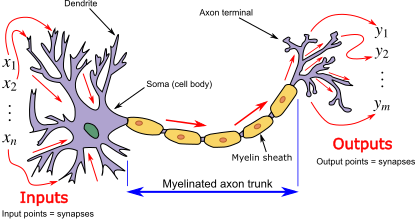

:::::::::::::::::::::::::::::::::::::: questions 

- What is an artificial neural network?
- What does “deep” mean in deep learning?
- How do neural networks learn from errors?
- Why does deep learning require substantial data and computing resources?

::::::::::::::::::::::::::::::::::::::::::::::::

::::::::::::::::::::::::::::::::::::: objectives

- Describe what an artificial neural network is using an analogy.
- Explain what "deep" means in deep learning.
- Identify types of tasks that deep learning excels at.
- Understand why deep learning requires a lot of data and computing power.

::::::::::::::::::::::::::::::::::::::::::::::::

## What is a Neural Network?

Deep learning is built on a concept called the artificial neural network.

The name comes from a loose analogy with biology. In the human brain, neurons receive signals from other neurons. If the combined signal is strong enough, the neuron "fires" and passes a signal onwards.

{alt='Neuron and myelinated axon, with signal flow from inputs at dendrites to outputs at axon terminals.'}

An artificial neuron works in a simplified mathematical way:

- It receives numbers as inputs.
- Each input is multiplied by a weight, which represents its importance.
- These weighted values are added together.
- If the result is large enough, the neuron produces an output. 
- That output is then sent to the next layer.

{alt='Artificial neural network with layer coloring'}

Both biological and artificial neurons act as filters that combine many incoming signals, weighted by importance, and decide whether the combined signal should be passed to the next layer and, if so, how strongly the it should be passed on. 

The differences, however, are just as important. A biological neuron is a very complex living cell embedded in a chemical environment. It communicates using electrochemical pulses, it can form and prune thousands of connections dynamically, and it operates within a brain of roughly 86 billion neurons shaped by millions of years of evolution. On the other hand, an artificial neuron is an arithmetic operation of a weighted sum followed by a mathematical function. The weights are adjusted during training by an algorithm, not by biological processes. Modern neural networks, despite their name, are better understood as powerful pattern-matching mathematical models than as simulations of the brain.

A single artificial neuron is rarely useful on its own. But, if you arrange many neurons together, you get a layer, and if you stack multiple layers you get a neural network.  It is the depth of the layer stacking that gives deep learning its name and its power.

### Layers and Depth

A neural network is typically organised into three types of layers:

- An input layer, which receives the raw data.
- One or more hidden layers, where most of the computation happens.
- An output layer, which produces the final prediction.

As data passes through the network, each layer transforms it into a slightly more abstract representation.

For example, in image recognition:

- An early layer might detect simple edges and lines.
- A later layer might detect shapes or textures.
- A deeper layer might detect complex structures such as faces.

In text processing:

- Early layers might detect characters or short word patterns.
- Middle layers might represent words or phrases.
- Later layers might capture aspects of meaning or context.

This hierarchical pattern detection is one of the main strengths of deep learning.

The word **deep** simply refers to the number of hidden layers. A shallow model might have one hidden layer. A deep model may have dozens or even hundreds of layers.

## Types of Neural Network

There are many neural network architectures, each suited to particular tasks.  Just a few common examples are discussed below.  

### Convolutional Neural Networks (CNNs)

CNNs are particularly effective for image and video analysis. They use specialised layers that focus on local patterns, such as edges and textures. Image classification tools  are built on this type of architecture.

Some examples of CNNs being used for image analysis in research include:

- Analysing satellite imagery to detect environmental change.
- Identifying cell structures in microscopy images.
- Digitising and classifying historical documents.
- Transcribing and analysing handwritten documents

### Recurrent Neural Networks (RNNs)

RNNs were designed to handle sequential data, such as time-series measurements or text. They process information step by step, maintaining a form of internal memory. In many applications, they have now been replaced by more advanced architectures.

### Transformers

Transformers are the foundation of most modern natural language processing systems. They are especially effective at modelling relationships within sequences of text and form the basis of contemporary large language models, which we will examine in the next episode.
 

To read more about different neural network architectures have a look at the [Neural Network Zoo](https://www.asimovinstitute.org/neural-network-zoo/), a cheat sheet for neural network architectures.

::::::::::::::::::::::::::::::::::::: challenge 

## Identifying Deep Learning in Research

Deep learning has transformed image recognition and, in some contexts, now matches or exceeds human performance.

Can you identify a research application in your field where deep learning for image recognition could be useful or is already in use?

:::::::::::::::::::::::: solution 

Examples may include:

- Analysing satellite imagery to detect environmental change.
- Identifying cell structures in microscopy images.
- Digitising and classifying historical documents.
- Transcribing and analysing handwritten documents

:::::::::::::::::::::::::::::::::

::::::::::::::::::::::::::::::::::::::::::::::::

## Training a Neural Network

First, a collection of software “neurons” are created and connected together, allowing them to send messages to each other. Next, the network is asked to solve a problem, which it attempts to do over and over, each time strengthening the connections that lead to success and diminishing those that lead to failure.

During training, a neural network follows a repeated cycle.

1. The network receives an input and produces a prediction.
2. The prediction is compared with the correct answer.
3. The difference between them is calculated as an error.
4. This error signal is sent backwards through the network.
5. The weights are adjusted slightly to reduce future errors.

Sending the error backwards through the network is known as **backpropagation**.  We'll mention this again in the next episode in the context of large language models.

This process is repeated across many examples, often millions, and over many passes through the dataset.

::::::::::::::::::::::::::::::::::::: challenge 

## Try Training a Neural Network

You can experiment with the process of training a neural network interactively using tools such as [Tensorflow Playground](https://playground.tensorflow.org).

The main task in TensorFlow Playground is classification: the network is trying to learn to separate two groups of data points (shown as orange and blue dots) by finding a boundary between them.

### What the colours mean

The data points (the small circles on the graph) are coloured orange or blue to show which group they belong to.

The background colour of the output panel shows what the network is currently predicting for every possible point on the graph. If an area is blue, the network would classify any point there as belonging to the blue group. If it is orange, it would classify it as orange. The deeper and more saturated the colour, the more confident the network is in that prediction. 

As training progresses, watch how the background pattern shifts and sharpens. This is the network adjusting its internal weights and gradually learning a better boundary between the two groups.

The lines connecting neurons in the hidden layers show the weights of the connections between neurons. A blue line means the connection has a positive weight and so the signal is passed forward and amplified. An orange line means the connection has a negative weight and so the signal is inverted or suppressed. Thick lines indicate strong weights in either direction whereas thin lines indicate weak ones. 

### What to try

- Press the play button and watch the network train. Notice how the background pattern in the output panel gradually changes as the network improves. The epoch counter shows how many times the network has passed through the training data. 
- Try increasing the number of hidden layers or neurons and observe whether the network can learn more complex boundaries.
- Try a more complex dataset (selectable on the left under 'DATA') and see whether the same network architecture struggles to separate the groups.
- Pause training at different points and observe how the confidence of the predictions, shown by colour intensity, changes over time.

::::::::::::::::::::::::::::::::::::::::::::::::

### Why So Much Data and Computing Power?

Modern neural networks often contain millions or even billions of adjustable parameters. Training them involves:

- **Processing very large datasets.**  In TensorFlow Playground you are working with a few hundred data points at most, a fraction of what real-world models require. Real models might be trained on millions of data points.
- **Performing repeated calculations across all parameters.** A deep learning model may have billions of equivalent values all being updated simultaneously.
- **Iterating many thousands of times.** Models may require tens of thousands of passes through the training data to converge.

This requires significant computational resources, often specialised hardware. Without large datasets and substantial computing power, deep models tend to perform poorly.

## How can I Train My Own Deep Learning Model?

Training a deep learning model from scratch is significantly more demanding than training a conventional machine learning model, but it is not out of reach for motivated researchers, particularly with access to institutional computing infrastructure and Research Software Engineering support. More commonly, researchers work with **pre-trained models** and adapt them, rather than training from scratch.

### What skills this requires

Deep learning requires all of the skills needed for conventional machine learning (programming in Python, data preparation, evaluation) plus additional capabilities. You will need familiarity with a **deep learning framework** such as PyTorch or TensorFlow, both of which have extensive documentation and active research communities.

**Access to appropriate hardware** is a practical requirement. Training deep learning models on a standard laptop CPU is rarely feasible for research-scale tasks. Most researchers use GPUs, either through institutional high-performance computing (HPC) facilities or cloud platforms such as Google Colab, which provides free GPU access for smaller experiments.

**Experiment management** becomes important at this level of complexity. Tracking which model configuration produced which results, managing large datasets, and handling training runs that may take hours or days requires a great deal of organisation and tools such as Weights & Biases or MLflow.

Deep learning also demands a somewhat deeper understanding of model architecture and training dynamics than conventional ML. You need enough conceptual understanding to diagnose when training is going wrong, for example, when a model is failing to learn, overfitting, or producing unexpected outputs.

::::::::::::::::::::::::::::::::::::: keypoints 

- Artificial neural networks consist of layers of weighted computational units inspired by biological neurons.
- 'Deep' refers to having multiple hidden layers that learn increasingly abstract representations.
- Training involves making predictions, measuring error, and adjusting weights using backpropagation.
- Deep learning excels at complex pattern recognition tasks such as image, audio, and text analysis.
- Large models require extensive data and computing resources to train effectively.

::::::::::::::::::::::::::::::::::::::::::::::::

## References

- [Neural Network Zoo](https://www.asimovinstitute.org/neural-network-zoo/)
- [Choosing the right deep learning model a comprehensive guide](https://www.artiba.org/blog/choosing-the-right-deep-learning-model-a-comprehensive-guide)
- [Tensorflow Playground](https://playground.tensorflow.org)
- [Carpentries Intro to AI for GLAM - What is machine learning good at?](https://librarycarpentry.github.io/lc-machine-learning/04-what-is-ml-good-at.html)
- [pytorch](https://pytorch.org/)
- [tensorflow](https://www.tensorflow.org/)

