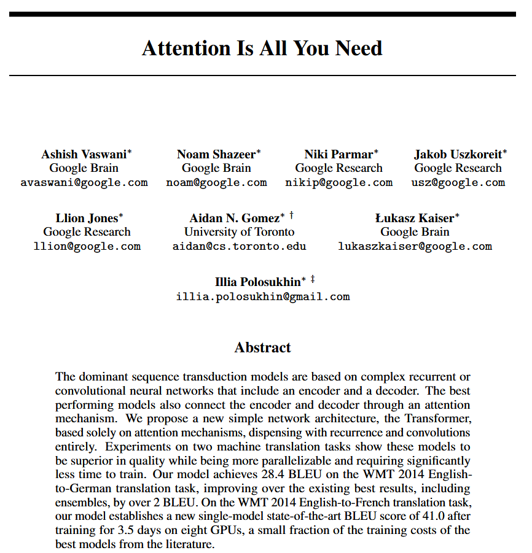
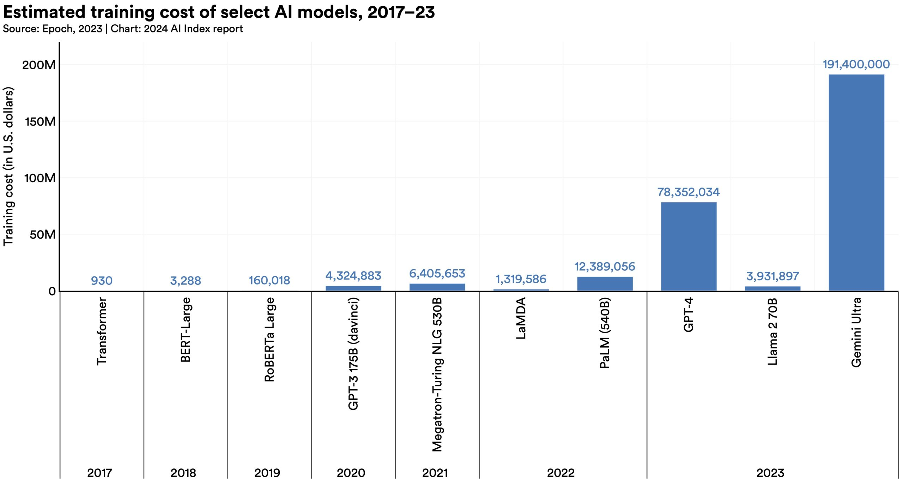
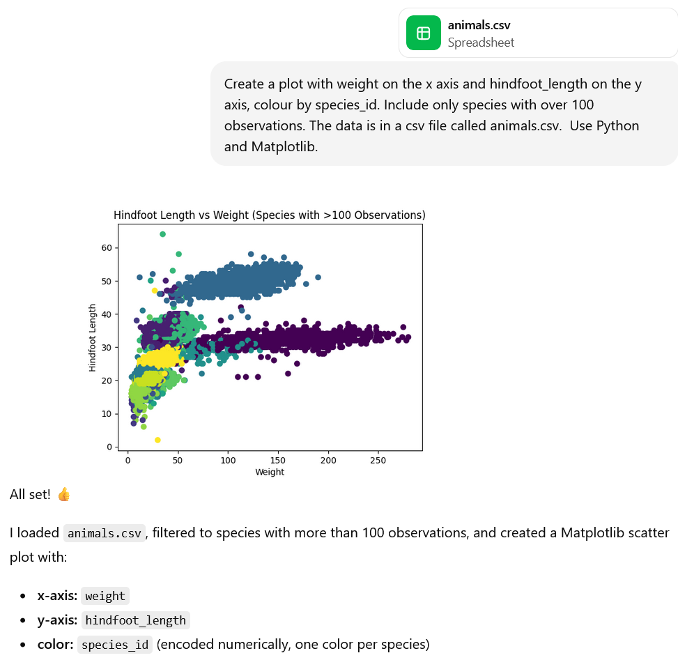
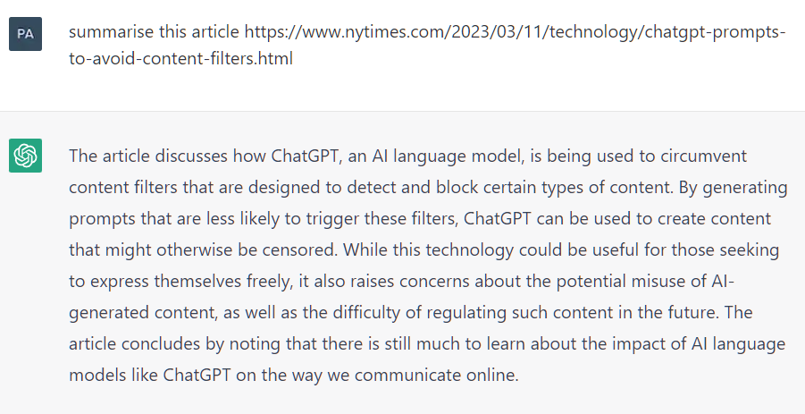
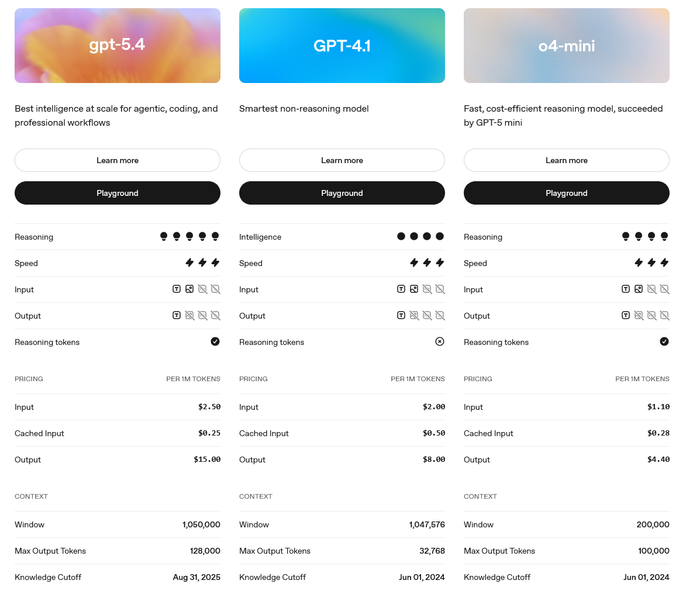

:::::::::::::::::::::::::::::::::::::: questions 

- What is a large language model and how does it relate to deep learning?
- How are LLMs trained, and what does "large" actually mean?
- Why do LLMs sometimes produce confident but incorrect information?
- What are the key limitations I should understand before using an LLM in my research?

::::::::::::::::::::::::::::::::::::::::::::::::

::::::::::::::::::::::::::::::::::::: objectives

- Explain what an LLM is and where it sits within the broader AI landscape.
- Describe the Transformer architecture and the attention mechanism.
- Distinguish between pre-training and fine-tuning.
- Define hallucination, knowledge cutoff, and context window, and explain why they matter for research use.

::::::::::::::::::::::::::::::::::::::::::::::::

## Introduction

Over the previous two episodes we have built up a picture of how machines can learn from data, and how deep neural networks can learn rich, layered representations of the world. In this episode we apply those ideas to language. We will explore **Large Language Models (LLMs)**, the technology behind tools such as ChatGPT, Claude, Gemini, and Copilot, to understand what they are, how they are built, and what their real limitations are.

By the end of this episode you will be in a much stronger position to use these tools critically and responsibly in your own research

## What is a Large Language Model?

A Large Language Model is a type of deep learning model trained on vast quantities of text, with the goal of learning how language works so that it can generate and respond to text in a coherent, useful way.

The word **"large"** refers to two things at once:

- **The training data:** modern LLMs are trained on trillions of words drawn from books, websites, academic papers, code repositories, and more.
- **The number of parameters:** parameters are the adjustable weights inside the network that are learned during training. Leading models have hundreds of billions, or even trillions, of these values.

:::::::::::::::::::::::::::::::::::::::::::::::::::::::::::::::::: callout

### Putting "large" in perspective

One trillion is 1,000,000,000,000. To give a sense of scale: if you counted one parameter per second without stopping, counting to one trillion would take over 31,000 years.
The sheer number of parameters is what allows these models to store and manipulate rich, nuanced representations of language.

::::::::::::::::::::::::::::::::::::::::::::::::::::::::::::::::::::::::::

Despite their apparent sophistication, LLMs are trained on a surprisingly simple objective: **given a sequence of words, predict what word is most likely to come next**.

Consider the sentence:

*The researcher submitted her manuscript to the...*

A well-trained model should assign a high probability to words like *journal* or *publisher*, and a low probability to words like *submarine* or *Tuesday*. By doing this billions of times across an enormous training corpus, the model is forced to learn grammar, facts, writing conventions, and even something resembling reasoning because all of these are encoded in the statistical patterns of language.

This is sometimes called **self-supervised learning**: the training data provides its own labels (the next word is always known from the text itself), so no human annotation is required.

## Transformer Architecture

LLMs are built on an architecture called the **Transformer**, introduced in a landmark 2017 paper titled ["Attention Is All You Need"](https://proceedings.neurips.cc/paper_files/paper/2017/file/3f5ee243547dee91fbd053c1c4a845aa-Paper.pdf) (cited over 234,000 times as of Spring 2026) written by researchers working for Google. Before the Transformer, models processed text one word at a time, which:

1. was slow 
2. made it hard to capture relationships between words that were far apart in a sentence. 

The Transformer solved both problems.

{alt="A screenshot of the title, authors and abstract of the paper 'attention is all you need'"}

### The Attention Mechanism

The key innovation of the Transformer is the **attention mechanism**. Rather than processing words in isolation, attention allows the model to look at all the words in a passage simultaneously and learn which ones are most relevant to understanding each particular word.

Consider this sentence:

*The bank was steep and muddy, so she slipped climbing down it.*

When processing the word *bank*, a human reader immediately uses context clues such as *steep*, *muddy*, and *climbing*, to understand that this is a riverbank, not a financial institution. The attention mechanism allows a Transformer to do something similar: it learns to assign higher attention weights to the words most relevant for correctly interpreting each part of the text.

The attention mechanism combined with the availability of large-scale computing hardware, triggered a step up in what language models could do. Essentially all major LLMs today including ChatGPT, Claude, and Gemini are built on the Transformer architecture.

## How LLMs Are Trained: Pre-training and Fine-tuning

### Stage 1: Pre-training

In the pre-training stage, the model is trained from scratch on an enormous, general-purpose body of text. The training objective is to predict the next word. The model adjusts its billions of parameters through backpropagation (the backward flow of error through a neural network, see [Episode 3](3-deep-learning.md)) until it becomes very good at predicting text across a huge range of topics and styles.

Pre-training is extremely  resource-intensive. Training a leading LLM can:

- Require thousands of specialised computer chips running in parallel for weeks or months.
- Consume millions of pounds' worth of electricity and hardware time.
- Produce a significant carbon footprint.  [One study](https://www.technologyreview.com/2019/06/06/239031/training-a-single-ai-model-can-emit-as-much-carbon-as-five-cars-in-their-lifetimes/#:~:text=A%20paper%20from%20the%20University%20of%20Massachusetts%2C,on%20teaching%20machines%20to%20handle%20human%20language.) found that training a single large transformer model can emit over 283,000 kg of carbon 

This cost means that pre-trained models are rarely trained from scratch by individual researchers or institutions. Instead, organisations release **pre-trained base models** that others can build on.

This bar plot below is from the Stanford Institute for Human-Centered Artificial Intelligence 2024 AI index. It shows the rapid increase in the computing cost of training large language models. 

{alt="Bar plot showing the rapid increase in the computing used to train large language models. It also shows that the training cost of the best closed large language models seems much higher than the training cost of the best open-weight ones, leading to higher performance. The training cost of models like GPT-4 is not publicly known, so this is just an estimate. The data is from Epoch in 2023, and the chart is from Stanford University's 2024 AI index."}

### Stage 2: Fine-tuning

Once a base model exists, it can be **fine-tuned**. This means it can be trained further on a smaller, more targeted dataset to adapt its behaviour for a specific purpose or domain. For example, a base model might be fine-tuned:

- on medical literature to improve its performance on clinical questions.
- on legal documents to better support contract analysis.
- using human feedback to make it more helpful, harmless, and honest in conversation.

That last approach, of using human ratings to guide the model toward more desirable outputs, is called **Reinforcement Learning from Human Feedback (RLHF)**. It is largely responsible for the conversational, 'helpful assistant' style of tools like ChatGPT. Human raters score model outputs, and the model is trained to produce outputs that score more highly.

:::::::::::::::::::::::::::::::::::::::::::::::::::::::::::::::::: callout

## Pre-training and Fine-tuning Analogy

Think of pre-training as an undergraduate education: the student reads broadly across many subjects and develops general knowledge and reasoning skills. Fine-tuning is then like a postgraduate specialisation: the student goes deep into a specific field, building on their broad foundation.

A model trained this way inherits both the strengths and the limitations of its pre-training. If the pre-training data contained biased, outdated, or incorrect material, those properties will be present in the base model and may persist even after fine-tuning.

::::::::::::::::::::::::::::::::::::::::::::::::::::::::::::::::::::::::::

## What LLMs Can Do

LLMs have demonstrated some amazing capabilities across a wide range of language tasks, including:

- **Text generation and summarisation** — producing coherent text, summarising long documents, drafting emails.
- **Question answering** — responding to factual queries based on patterns in training data.
- **Translation** — converting text between languages.
- **Code generation** — writing, explaining, and debugging computer code.
- **Step-by-step reasoning** — working through multi-step problems when prompted appropriately.
- **Information extraction** — identifying entities, relationships, or themes in text.

For researchers, LLMs offer potential value in tasks such as summarising literature, drafting sections of text for revision, assisting with qualitative coding, generating data analysis computer code, and exploring ideas interactively.

For example, given a dataset, an LLM can generate code for tasks such as data analysis. Generative AI tools can even run the code as well! This is incredible but **we should be cautious when outsourcing these tasks to LLMs** due to several limitations that we will discuss below.

{alt="Screenshot of uploaded csv, chatGPT prompt, and generated plot"}

## What LLMs Cannot Do: Key Limitations

Understanding what LLMs *cannot* reliably do is at least as important as knowing what they can do, especially for research applications where accuracy and reproducibility matter.

### Hallucination

Perhaps the most important limitation to understand is **hallucination**: LLMs often generate confident, fluent, plausible-sounding text that is factually incorrect.

This is not an occasional bug that will eventually be fixed, it is a fundamental property of how these models work. An LLM is optimised to produce coherent, contextually appropriate text but it is not optimised to produce truth. It has no direct access to a database of facts it can look up. Instead, it generates text by predicting what is most likely to come next, based on patterns learned during training.

In practice this means an LLM might:

- Invent citations to academic papers that do not exist, complete with plausible-sounding titles, authors, and journal names.
- State incorrect dates, statistics, or quotations with complete confidence.
- Describe the findings of a study inaccurately, even when the study is real.

For example, the Google AI Overviews result (10 August 2025) incorrectly stated that Joaquín Correa is the brother of Ángel Correa while in reality the two are unrelated.

{alt="AI Overviews result for Joaquin Correa brother, 10 August 2025"}

Another example - when prompted to "summarize an article" with a fake URL that contains meaningful keywords, even with no Internet connection, ChatGPT generates a response that seems valid at first glance.

{alt="An example of a ChatGPT hallucination. When prompted to “summarize an article” with a fake URL that contains meaningful keywords as slug, even with no Internet connection, the chatbot generates a response that seems valid at first glance."}

:::::::::::::::::::::::::::::::::::::::::::::::::::::::::::::::::::::: callout
### Why is it called 'hallucination'?

The term is borrowed from psychology, where hallucination refers to perceiving something that is not actually there. When an LLM "hallucinates", it generates content that feels real and is presented confidently, but has no basis in fact. The model has no way to flag its own uncertainty in the way a cautious human expert might say "I'm not certain, but I believe...". That's why it's important to verify factual claims from LLMs using primary sources.

::::::::::::::::::::::::::::::::::::::::::::::::::::::::::::::::::::::::::::

### Knowledge Cutoff

LLMs are trained on data collected up to a specific point in time, this is known as their **knowledge cutoff** date. They have no awareness of events, publications, or developments that occurred after that date, unless they are connected to external tools such as a web search capability.

For example, GPT-5.4 (the latest OpenAI model as of March 2026) has a knowledge cutoff of August 31st 2025 and GPT-4.1 has a knowledge cutoff of 1st June 2024 ([OpenAI Developers - Compare Models ](https://developers.openai.com/api/docs/models/compare)). 

This matters particularly for research, where the most recent literature may be the most relevant. An LLM asked about the current state of a fast-moving field may give a confident account that is months or years out of date.

{alt="screenshot of the comparison between features of three GPT models"}

### Stochasticity: Different Answers Each Time

LLM outputs are **probabilistic** rather than deterministic. Even when given exactly the same input, an LLM will often produce a different output on subsequent runs. This has implications for reproducibility in research: if you use an LLM in your methodology, you cannot guarantee that re-running your analysis will produce identical results.

### Context Window

Every LLM has a **context window**, which is the maximum amount of text it can "see" and process at one time. You can think of it as the model's working memory for a single interaction. If you provide a document that exceeds the context window, the model may be forced to ignore parts of it, potentially affecting the quality of its output.

Context window sizes vary widely across models and have grown considerably in recent years, but they remain a practical constraint when working with very long documents.

The context window for the free tier of ChatGPT using the model 'GPT-5.3 Instant' is 16,000 tokens (words, parts of words or punctuation), whereas the context window of 'GPT-5.4 Thinking' is 400,000 tokens ([OpenAI Help Docs](https://help.openai.com/en/articles/11909943-gpt-53-and-gpt-54-in-chatgpt))

### No Genuine Understanding

Finally, it is important to resist the temptation to interpret LLM fluency as understanding. An LLM produces text by sophisticated pattern matching and it does not have beliefs, intentions, or knowledge in the way a human expert does. A model that can write a convincing paragraph about quantum mechanics has not 'understood' quantum mechanics, it has just learned what such paragraphs tend to look like.

:::::::::::::::::::::::::::::::::::::::::::::::::::::::::::::::::: callout

### Summary of key LLM limitations

| Limitation | What it means in practice |
|---|---|
| Hallucination | Outputs may be confidently wrong; always verify factual claims |
| Knowledge cutoff | The model is unaware of events after its training data ends |
| Stochasticity | The same question can produce different answers |
| Context window | Very long documents may be partially ignored |
| No verified understanding | Fluency does not equal accuracy or expertise |

::::::::::::::::::::::::::::::::::::::::::::::::::::::::::::::::::::::::::

::::::::::::::::::::::::::::::::::::::::: challenge

### Challenge: True or False?

For each statement below, decide whether it is true or false, and briefly explain your reasoning.

1. When an LLM answers a question, it searches the internet and retrieves the most relevant facts.
2. A fine-tuned LLM trained on medical literature will always give accurate medical information.
3. Two researchers using the same LLM with the same prompt will always receive identical outputs.

::::::::::::::::::::: solution

### Solution

1. **False.** A standard LLM generates responses based on patterns learned during training — it does not retrieve information from a live database or the internet. Some LLMs are connected to web search tools, but this is an added capability, not a core feature of how the model works.

2. **False.** Fine-tuning on domain-specific text can improve performance in a given area, but it does not eliminate hallucination. A model can still produce confident but incorrect medical information. Domain expertise does not guarantee accuracy.

3. **False.** LLM outputs are probabilistic. The same input can produce different outputs across different sessions, or even within the same session, because the model samples from a distribution of possible next words rather than selecting a single deterministic answer.

:::::::::::::::::::::::::::::

::::::::::::::::::::::::::::::::::::::::::::::::::

::::::::::::::::::::::::::::::::::::: challenge 

## Testing the Limitations of LLMs

Go to a conversational AI tool such as ChatGPT, Microsoft Copilot or Claude and ask the following questions:

1. Ask the model to provide three references on a niche academic topic. Note any invented or inaccurate citations.
2. Ask the same question twice and compare outputs.
3. Ask about a very recent event, publication, or development in your field and observe how the model responds.  Does it admit uncertainty, speculate, give outdated information, or turn to web search capabilities?
4. Ask the model to summarise a short paragraph you provide.  You could use the paragraph above about the attention mechanism or provide one of your own.

:::::::::::::::::::::::: solution 

1. Possibility of hallucination
2. Stochasticity demonstration - two responses to the same prompt are likely to differ.
3. Knowledge cutoff demonstration - LLMs only have knowledge of events prior to when they were trained. 
4. This illustrates a task where LLMs usually do well.

:::::::::::::::::::::::::::::::::

::::::::::::::::::::::::::::::::::::::::::::::::::

## Could I Build or Fine-Tune My Own LLM?

For most researchers and institutions, training an LLM from scratch is not realistic. The compute and financial resources required place it firmly in the domain of large technology companies. However, there are several meaningful ways researchers can work with and adapt language models without training one from scratch.

### What skills this requires

Fine-tuning a language model requires all of the skills described in the deep learning section above, plus familiarity with the specific landscape of **large language model tooling**.  This may include the [Hugging Face ecosystem](https://huggingface.co), which provides pre-trained models, fine-tuning utilities, datasets, and deployment infrastructure that have become the de facto standard for research-scale language model work.

**Working with large datasets of text** introduces additional challenges. Cleaning and de-duplicating large amounts of text, handling tokenisation, and managing data pipelines that may involve hundreds of gigabytes of text. These problems involve software engineering skills as well as machine learning expertise.

For fine-tuning, **understanding the task you are optimising for** matters a lot.  You'd need to carefully design the approaches for determining which data to use and how to evaluate the model.

:::::::::::::::::::::::::::::::::::::::::::::::::::::::::::::::::: callout

### The Hugging Face ecosystem

[Hugging Face](https://huggingface.co) is the primary hub for open-source language model research. It hosts thousands of pre-trained models, datasets, and fine-tuning tools, and its `transformers` library is the standard Python interface for working with language models in research. If you are considering any form of language model work, this is the most important resource to be aware of. The Hugging Face [NLP Course](https://huggingface.co/learn/nlp-course) is a free introductory course on working with language models in code.

::::::::::::::::::::::::::::::::::::::::::::::::::::::::::::::::::::::::::

## Summary

In this episode we have seen how the simple task of predicting the next word can lead to the powerful, general-purpose language tools that are reshaping how people interact with information today. 

In [Episode 5](5-ai-in-research.md), we will bring together everything from the course to explore how AI tools, including LLMs, are being used in research today, and how to evaluate them critically and ethically.

::::::::::::::::::::::::::::::::::::: keypoints 

- LLMs are deep learning models trained on massive text datasets to predict the next word, from which broad language capabilities emerge.
- The Transformer architecture, and its attention mechanism, is the foundation of all major modern LLMs.
- Pre-training builds general language knowledge; fine-tuning specialises a model for particular tasks or behaviours.
- LLMs hallucinate — they generate confident but factually incorrect content — because they are optimised for coherent text, not verified truth.
- LLMs have a knowledge cutoff date and are unaware of more recent events unless equipped with external search tools.
- Outputs are probabilistic: the same prompt can produce different responses, with implications for research reproducibility.

::::::::::::::::::::::::::::::::::::::::::::::::

## References

- [Vaswani, A., Shazeer, N., Parmar, N., Uszkoreit, J., Jones, L., Gomez, A. N., ... & Polosukhin, I. (2017). Attention is all you need. Advances in neural information processing systems, 30.](https://proceedings.neurips.cc/paper/2017/hash/3f5ee243547dee91fbd053c1c4a845aa-Abstract.html)
- [Stanford AI Index](https://hai.stanford.edu/ai-index)
- [OpenAI Help Docs](https://help.openai.com/en)
- [OpenAI Developers Documentation](https://developers.openai.com/)
- [Hugging Face](https://huggingface.co)

