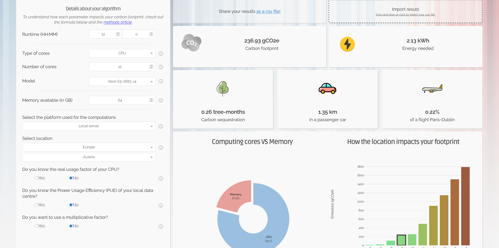
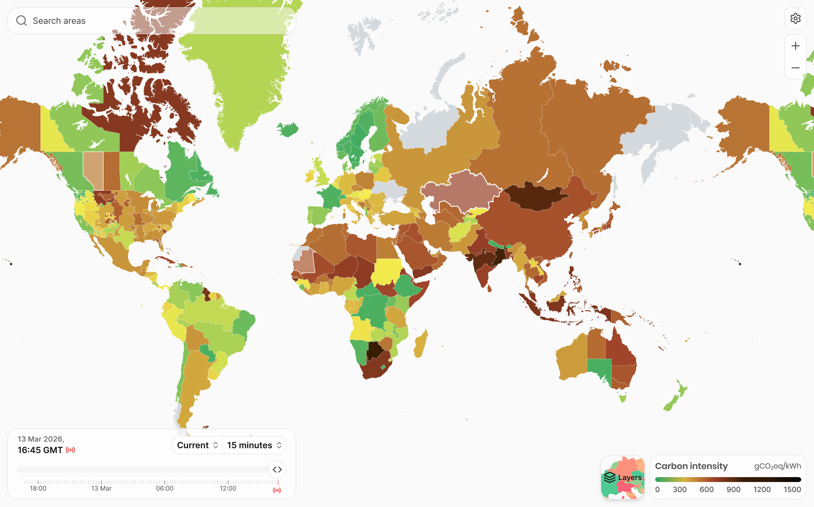

:::::::::::::::::::::::::::::::::::::: questions

- How are AI techniques being used across research disciplines today?
- What questions should I ask before adopting an AI tool in my research workflow?
- What ethical responsibilities do I have as a researcher using AI?
- How do I handle transparency and reproducibility when AI has been part of my methodology?

::::::::::::::::::::::::::::::::::::::::::::::::::

::::::::::::::::::::::::::::::::::::: objectives

- Identify AI applications relevant to your own research discipline.
- Apply a set of critical evaluation questions to any AI tool before adopting it.
- Describe the key ethical concerns raised by the use of AI in research, including bias, transparency, privacy, and attribution.
- Explain why reproducibility is a particular challenge when AI is part of a research workflow.

::::::::::::::::::::::::::::::::::::::::::::::::

## Introduction

Throughout this course we have built up a conceptual map of the AI landscape: from the broad field of machine learning, to deep learning with neural networks, to the language capabilities of large language models. In this final episode we ask the question: "What can I do with AI in my research?"

The goal of this episode is not to tell you whether to use AI in your research, but to allow you to make informed decisions when using AI including how to recognise opportunities, ask the right critical questions, and engage seriously with the ethical responsibilities that come with AI tools.

## How Researchers Are Using AI Today

AI techniques are being applied across virtually every research domain. The examples below are illustrative rather than exhaustive.  The aim of this episode is to help you begin connecting the technical ideas from earlier episodes to work that may be relevant to your own field.

### Working with Text

Text is one of the most abundant forms of data in research, and AI tools for working with text are among the most mature. Researchers are using LLMs and related tools to:

- Assist with literature reviews by summarising large volumes of papers.
- Support qualitative coding of interview transcripts, field notes, or open-ended survey responses.
- Draft and revise written outputs such as grant applications, reports, and manuscripts.
- Extract structured information such as dates, entities, or relationships from unstructured documents such as historical records or clinical notes.
- Analyse sentiment or tone across large amounts of text, such as social media data or policy documents.

:::::::::::::::::::::::::::::::::::::::::::::::::::::::::::::::::: callout

### AI for Systematic Reviews

Tools such as [ASReview](https://asreview.nl/) use machine learning to accelerate the title and abstract screening stage of systematic reviews.

[ASReview](https://asreview.nl/) is an open-source machine learning tool designed specifically to assist researchers with the title and abstract screening stage of systematic reviews. Rather than screening papers in a fixed order, ASReview learns from each inclusion or exclusion decision the reviewer makes and continuously re-ranks the remaining papers, surfacing the most likely relevant records first. 

This means the most important papers tend to be found early, and screening can stop before every record has been manually checked.

ASReview is free to use, runs in a web browser, requires no programming knowledge, and produces a full log of every decision made during screening, which can be reported in a methods section. It is described in a peer-reviewed paper in Nature Machine Intelligence [(van de Schoot et al., 2021)](https://www.nature.com/articles/s42256-020-00287-7) and has been used in fields including medicine, psychology, and environmental science.

::::::::::::::::::::::::::::::::::::::::::::::::::::::::::::::::::::::::::

### Analysing Images and Signals

Convolutional neural networks (introduced in [Episode 3](3-deep-learning.md)) have transformed the analysis of visual data and complex signals. Applications include:

- Classifying cell types or identifying anomalies in microscopy images.
- Detecting objects or changes in satellite or aerial imagery for environmental, geographic, or agricultural research.
- Supporting diagnostic imaging in clinical settings by identifying tumours, fractures, or lesions.
- Recognising patterns in audio signals such as birdsong, seismic activity, or cardiac rhythms.

:::::::::::::::::::::::::::::::::::::::::::::::::::::::::::::::::: callout

### Machine Learning to Identify Bird Species from Birdsong Features  

Researchers used machine learning methods to investigate which acoustic features of birdsong are most helpful for species identification ([Rivera et al., 2023](https://www.nature.com/articles/s41598-023-33825-5))

::::::::::::::::::::::::::::::::::::::::::::::::::::::::::::::::::::::::::

:::::::::::::::::::::::::::::::::::::::::::::::::::::::::::::::::: callout

### Filling Gaps and Removing Clouds from Remote Sensing Images

Researchers used neural networks to reconstruct missing areas in images from satellite remote sensing ([Wang et al., 2024](https://www.sciencedirect.com/science/article/abs/pii/S0034425724005728?via%3Dihub)). These images are a very important tool for observing the changes to the Earth's land surface. For example, they are used to assess the impacts of climate change on ecosystems and monitoring the responses from plants.

::::::::::::::::::::::::::::::::::::::::::::::::::::::::::::::::::::::::::

### Working with Structured Quantitative Data

Supervised machine learning methods are highly effective for analysing structured datasets of the kind that appear throughout quantitative research.  For example:

- Predicting outcomes in clinical trials or epidemiological studies.
- Detecting anomalies or fraud in financial datasets.
- Classifying observations in ecology.
- Building recommendation systems for research infrastructure, such as suggesting reviewers for journal submissions.

:::::::::::::::::::::::::::::::::::::::::::::::::::::::::::::::::: callout

### Detecting and Predicting Fraud in Credit Card Transactions

Researchers studied the performance of three types of machine learning in detecting and predicting fraudulent credit card transactions.  One machine learning model (random forest) was 96% accurate. These models will hopefully be used to protect credit card holders from fraud ([Afriyie et al., 2023](https://www.sciencedirect.com/science/article/pii/S2772662223000036?via%3Dihub))

::::::::::::::::::::::::::::::::::::::::::::::::::::::::::::::::::::::::::

### Code and Data Analysis Assistance

LLMs have rapidly become practical tools for researchers who work with data by writing code. AI coding assistants can write, explain, and debug code in languages such as Python and R, making computational methods more accessible to researchers who do not have a formal programming background. This can be incredibly useful but you should be cautious about using AI-written code in your research if you don't understand it. Due to the limitations in LLMs, AI generated code isn't always correct! There is currently limited peer-reviewed literature specifically evaluating LLM-generated research code in production workflows, most evidence is observational or anecdotal. 

:::::::::::::::::::::::::::::::::::::::::::::::::::::::::::::::::: callout

### AI as a Collaborator

A theme running through all of these applications is that AI tools work best when used as a tool to complement the expertise of a human researcher, rather than replacing the researcher. An LLM that assists with qualitative coding still requires a researcher who understands the domain, the methodology, and the data. A computer vision model that flags anomalies in microscopy images still requires a scientist who can interpret what those anomalies mean.

::::::::::::::::::::::::::::::::::::::::::::::::::::::::::::::::::::::::::

## Ethical Considerations

Using AI in research is an ethical as well as a methodological question. The following are among the most important issues for researchers to engage with.

### Environmental Cost of AI

The environmental cost of AI is larger and more complex than most users appreciate. Due to increasing demand, data centres could consume up to 9% of global electricity demand by 2030 ([Hankendi et al., 2025](https://pmc.ncbi.nlm.nih.gov/articles/PMC12613045/)). AI systems are the fastest-growing source of this demand, but measuring their precise impact is difficult because operators rarely separate AI from non-AI workloads in their environmental reporting. The most recent estimates suggest that in 2025, AI systems generated up to 79.7 million tonnes of carbon - comparable to the annual emissions of a major city - and consumed up to 764 billion litres of water, comparable to global bottled water consumption ([de Vries-Gao, 2025](https://doi.org/10.1016/j.patter.2025.101430)). 

{alt="Google Data Center, The Dalles, Oregon"}

Environmental costs accumulate across the full lifecycle of an AI model. This includes the water and carbon used to manufacture the specialist chips required to run the AI; the intensive one-off cost of training the model; and the ongoing costs of inference (the cost every time a query is run).

**Lifetime costs**: Embodied carbon (the carbon produced from manufacturing the hardware) can account for a significant fraction of the overall environmental cost of the model, but it is challenging to calculate and seldom reported. 

**Training**: A [2019 study](https://www.technologyreview.com/2019/06/06/239031/training-a-single-ai-model-can-emit-as-much-carbon-as-five-cars-in-their-lifetimes/#:~:text=A%20paper%20from%20the%20University%20of%20Massachusetts%2C,on%20teaching%20machines%20to%20handle%20human%20language.) found that training a single large transformer model can emit over 283,000 kg (626,000 pounds) of carbon, which is roughly equivalent to five times the lifetime emissions of an average American car (including the emissions from building the car!). 

**Inference**: Although many people believe that initial training has the largest environmental cost, recent studies have found that inference can actually account for up to 90% of a model’s lifetime energy use ([Desislavov et al., 2023](https://www.sciencedirect.com/science/article/pii/S2210537923000124)). Water consumption follows a similar pattern, with estimates suggesting a standard ChatGPT conversation of 20–50 exchanges requires roughly 500 millilitres of freshwater for cooling the servers in data centres ([Li et al., 2023](https://dl.acm.org/doi/10.1145/3724499)).

Some tools exist that can help developers better understand the cost of training and inference, for example in the Green Algorithms AI calculator users can enter details on the hardware, runtime, and location of the work and see the potential environmental cost: [https://calculator.green-algorithms.org/ai](https://calculator.green-algorithms.org/ai).

{alt="Screenshot of the green algorithms calculator"}

Not all AI is equally environmentally expensive. General-purpose LLMs are orders of magnitude more energy-intensive per inference than smaller, task-specific models performing the same job. This means that the convenience of using a single general-purpose LLM interface can carry a substantial and largely invisible environmental cost when multiplied across many uses. A fine-tuned model used for classification or information extraction may produce comparable results at a fraction of the per-query energy cost ([Luccioni et al., 2024](https://doi.org/10.1145/3630106.3658542)).

Similarly not all energy has the same environmental impact, data centers that run using renewable electricity (electricity that has a lower “carbon intensity”) will have reduced environmental impact.  The [Electricity Maps](https://app.electricitymaps.com/map/live/fifteen_minutes) website maps the amount of greenhouse gas (equivalent) emitted for every kWH of electricity produced, it’s clear that training an AI model in a data center in e.g. Scandinavia would have a lower environmental impact than training the model in Australia. However, the relationship between renewable energy and AI's actual carbon footprint is more complex than it first appears. Many data centre operators claim to run on renewable energy by purchasing Renewable Energy Certificates (RECs), which allow them to offset their consumption on paper without necessarily drawing clean power from the grid in real time. This distinction - between matching renewable energy and actually using it - has attracted significant criticism of major providers including Google and Microsoft ([Bjørn et al., 2022](https://www.nature.com/articles/s41558-022-01379-5)).

{alt="Screenshot of the electricity maps website showing the carbon intensity i.e. the grams of CO2 equivalent per kilowatt-hour (gCO2eq/kWh) measuring the greenhouse gas emissions from generating electricity"}

But overall, the biggest obstacle to accurate environmental accounting for AI is the problem of transparency. The companies operating the largest AI systems publish very little useful data. Furthermore, the published per-query emissions figures from AI providers typically reflect optimised, market-based conditions that incorporate REC purchases, rather than an accurate estimate of carbon and water usage ([de Vries-Gao, 2025](https://doi.org/10.1016/j.patter.2025.101430)). Until providers are required to report location-based emissions data transparently and consistently, the true environmental cost of AI will remain difficult to measure and easy to understate ([Masanet et al., 2024](https://www.cell.com/joule/fulltext/S2542-4351(24)00347-7)).

::::::::::::::::::::::::::::::::::::::::: challenge

## Environmental Cost Discussion

Can the societal benefits of AI justify its environmental costs? Where should we draw the line?

::::::::::::::::::::: solution

## Points to consider

### Benefits Justify Costs

- AI is already being used in climate-relevant applications: optimising energy grids, accelerating materials discovery for batteries and solar cells, improving weather and climate modelling, and monitoring deforestation via satellite imagery. These applications could meaningfully contribute to decarbonisation long-term.
- Drug discovery and medical diagnostics applications could save lives and reduce the resource burden of healthcare systems.
- Efficiency gains from AI in logistics, agriculture, and manufacturing may reduce emissions elsewhere in the economy, potentially offsetting AI's own footprint.

### Costs Outweigh Benefits

- The benefits of AI are often speculative or early-stage, while the environmental costs are immediate and certain. Should we be justifying present costs with uncertain future benefits?
- Many of the highest-energy AI applications, such as generating images, powering chatbots, and recommending content, have unclear societal benefit relative to their cost.
- Efficiency gains from new technologies have historically tended to increase overall consumption.  This a phenomenon known as the [Jevons paradox](https://en.wikipedia.org/wiki/Jevons_paradox) because in 1865, the English economist William Stanley Jevons observed that technological improvements that increased the efficiency of coal use led to the increased consumption of coal in a wide range of industries. 
- The benefits of AI are unevenly distributed globally, while environmental costs, particularly water stress, fall disproportionately on communities that may derive little benefit from the technology.

### Who decides where we draw the line?

- "Societal benefit" is not a neutral concept, it depends on whose society and whose benefits are being counted. Researchers, developers, regulators, and affected communities may weigh the trade-offs very differently.
- Individual researchers have limited power over the training of frontier models, but they do have agency over which tools they choose, how often they use them, and whether they advocate for greater transparency and accountability from providers.
- Should the decision be left to market forces, regulated by governments, or governed by professional communities such as researchers?

### Where do we draw the line?

- Is it possible to draw a principled line, or does it require case-by-case judgement? A diagnostic AI that saves lives in a resource-limited setting may be easier to justify than a generative AI that writes marketing copy.
- Should the burden of proof lie with those deploying AI to demonstrate net benefit, or with critics to demonstrate net harm?
- Who bears responsibility? Is it the companies training the models, the institutions deploying them, or the researchers using them?

:::::::::::::::::::::::::::::

::::::::::::::::::::::::::::::::::::::::::::::::::

### Bias and Fairness

AI models do not arrive in the world as neutral tools. They are trained on data generated by human societies, and those societies contain historical and structural inequalities. A model trained on historical medical records will reflect historical disparities in who received care and who was documented. A model trained on published academic literature will reflect who has historically had access to publish.

The consequences can be serious. Models used for clinical risk prediction have been shown to perform worse on patients from groups underrepresented in the training data. Automated tools used in hiring or admissions have reproduced patterns of discrimination from historical decisions.

:::::::::::::::::::::::::::::::::::::::::::::::::::::::::::::::::: callout

### Racial Bias in Health Algorithms

Researchers found evidence of racial bias in one of the most widely used algorithms in the US health care system.

For patients assigned the same level of risk by the algorithm, Black patients were sicker than White patients. The authors estimated that this racial bias reduces the number of Black patients identified for extra care by more than half. This bias occurs because the algorithm uses health costs as a proxy for health needs. Less money is spent on Black patients who have the same level of need, and the algorithm thus falsely concludes that Black patients are healthier than equally sick White patients. Reformulating the algorithm so that it no longer uses costs as a proxy for needs eliminates the racial bias in predicting who needs extra care ([Obermeyer et al., 2019](https://www.science.org/doi/10.1126/science.aax2342)).

::::::::::::::::::::::::::::::::::::::::::::::::::::::::::::::::::::::::::

### Transparency and Reproducibility

Research integrity depends on being transparent about your methods. When AI is part of your workflow, transparency requires:

- Stating clearly which AI tools were used, for what purpose, and at what stage of the research.
- Citing specific model versions wherever possible, so that readers can assess potential limitations and replicate your approach.
- Describing how you validated or checked AI-generated outputs.
- Acknowledging limitations that arise specifically from using AI, such as the probabilistic nature of LLM outputs or the knowledge cutoff of the model used.

### Privacy and Data Governance

Many AI tools, particularly cloud-based LLMs, process data on external servers. If you input sensitive data such as patient records, interview transcripts, or confidential documents, into a commercial AI tool, you may be:

- Breaching participant confidentiality.
- Violating data protection legislation such as the UK GDPR.
- Contravening your institution's data governance policies or your ethical approval conditions.

Before inputting any data into an AI tool, check your institution's and research group's guidance on what categories of data may be processed in this way, and review the tool provider's privacy and data retention policies.

### Attribution and Authorship

LLMs have raised genuinely novel questions about authorship and attribution that the research community is still working through. Key issues include:

- **Authorship of AI-generated text:** most major publishers and funders now have explicit policies stating that AI tools cannot be listed as authors, because authorship carries accountability that an AI model cannot hold. However, policies on *disclosing* the use of AI in drafting or editing text vary and are evolving rapidly.
- **Attribution of AI-generated analysis:** if an LLM assists with qualitative coding or data interpretation, how should that contribution be disclosed in the methods section?
- **Copyright in training data:** LLMs are trained on text that may include copyrighted material. The legal and ethical status of this is an active area of debate.  By including AI-generated text or code in your research, you may inadvertantly be infringing copyright.

You should check the current policies of your target journal or funder, and your institution's own guidance, before submitting work in which AI has played a role.

::::::::::::::::::::::::::::::::::::::::: challenge

### Critically Reviewing AI Use in Qualitative Research

**Scenario**: You are reviewing a manuscript submitted to your field's leading journal. In the methods section, the authors write:

> *"Qualitative thematic analysis of interview transcripts was supported by an AI language model, which was used to generate initial codes. These codes were then reviewed and refined by the research team. The AI tool assisted with the analysis of all 47 transcripts."*

Discuss the following questions:

1. What information is missing from this methods description that you would need as a reviewer?
2. What risks or limitations should the authors have acknowledged?
3. What would a more complete and transparent methods statement look like?

::::::::::::::::::::: solution

### Points to consider

**Information that is missing:**

- Which AI tool was used, and which version? (Without this, the approach cannot be evaluated or replicated.)
- What prompts or instructions were given to the model?
- How were AI-generated codes accepted, modified, or rejected?
- Was the tool validated on similar data or in similar research contexts?
- How was participant data handled? Was it anonymised before being input? Was the tool's data retention policy checked against ethical approval conditions?

**Risks and limitations the authors should have acknowledged:**

- LLMs can produce plausible-sounding codes that do not accurately reflect the content of the transcript.
- The model may perform inconsistently across different transcripts, introducing variability that is difficult to detect.
- The model's outputs may reflect biases in its training data rather than patterns in the research data.
- If the same analysis were run again, the model might produce different initial codes.

**A more complete methods statement might include:**

- The name and version of the AI tool used.
- A description of how the tool was prompted and integrated into the coding workflow.
- A statement of how participant data was handled in compliance with ethical approval and data protection requirements.
- A description of the human review process e.g. how many researchers reviewed codes, whether inter-rater reliability was assessed, how disagreements were resolved.
- An explicit acknowledgement of the limitations of AI-assisted coding and how these were mitigated.

:::::::::::::::::::::::::::::

::::::::::::::::::::::::::::::::::::::::::::::::::

## Cognitive Offloading and De-skilling with Generative AI

AI tools are can be incredibly useful for many research tasks but there is a risk that comes with using them that is easy to overlook: the less we do something ourselves, the less capable we become at doing it.
This phenomenon has been described cognitive offloading. It is not a new issues, for example, using a calculator means we practise mental arithmetic less, and using GPS navigation means we build less of an internal sense of geography. Sometimes this is a reasonable trade-off, but in research, where the ability to think carefully, critically, and independently is central to what you do, its worth considering whether the trade-offs are worth it. 

One example, relevant to anyone who develops or uses research software, is the use of AI coding assistants to generate code for experiments, simulations or data analysis.  If you're using code to process your data or run your analyses, that code is part of your methodology. If you did not write it and do not fully understand it, you cannot be certain it is doing what you think it is doing and therefore you cannot be fully confident in your results. AI-generated code can contain subtle errors that produce outputs which look plausible but are wrong. A researcher who understands the code can catch these errors but a researcher who doesn't understand the code may not, and these errors could affect your research results.

More generally, every time we outsource a cognitive task to an AI, we don't get the practice at doing it ourselves. Over time, this can make us lose the underlying skill. A researcher who always asks an LLM to summarise papers may gradually lose the habit of reading them carefully. A researcher who always asks an LLM to draft text may find their own writing voice harder to find. 

Research depends on deep and independent thinking.  To do good research, researchers need to sit with a difficult problem, reason through it and arrive at your own conclusions.  Using AI thoughtfully involves deliberate decisions about which tasks to outsource to AI and which to do yourself, not because an AI couldn't do it, but because it a part of your human intelligence that you'd like to protect. 

## Looking Ahead: Developing Your AI Literacy

This course has given you a map of the AI landscape and the vocabulary to navigate it. 

A few practical suggestions for developing your AI literacy beyond this course:

- **Follow your institution's guidance.** Most universities and research funders are actively developing AI use policies. These are the most directly relevant to your work, and they will continue to evolve. For example, for researchers at the University of Southampton, point 3.8 of the [Ethics Policy for Research at University of Southampton](https://www.southampton.ac.uk/about/governance/regulations-policies/policies/ethics) shows the Principle of ethical conduct of research when using Artificial Intelligence (AI) and students should also consult guidance on [Using generative artificial intelligence during your studies ](https://www.southampton.ac.uk/about/governance/regulations-policies/policies/using-gen-ai-during-your-studies).
- **Engage with your research community.** Methodological norms for AI use in research are being worked out discipline by discipline. Engaging with debates in your own field's journals and conferences is more valuable than generic AI news.
- **Start small and validate.** If you are considering integrating an AI tool into your workflow, start with a small, low-stakes task and validate the outputs carefully before scaling up.
- **Be transparent.** When in doubt about how much to disclose about your use of AI, err on the side of transparency. The research community is better served by over-disclosure than by the opposite.

::::::::::::::::::::::::::::::::::::: keypoints

- AI techniques are being applied across research disciplines, from text analysis and image classification to code generation and structured data modelling.
- Before adopting any AI tool, ask: what was it trained on? Has it been validated? Can results be reproduced? Can outputs be explained? What are the failure modes?
- AI models reflect the biases in their training data.
- Transparency in methods is essential: report which tools were used, at what version, for what purpose, and how outputs were validated.
- Privacy and data governance must be considered before inputting any sensitive or personal data into an AI tool.
- Authorship, attribution, and environmental cost are emerging ethical considerations that researchers should engage with actively.
- Consider the impacts on human intelligence when outsourcing tasks to AI
- Developing AI literacy is an ongoing practice: follow institutional guidance, read model documentation, and engage with methodological debates in your own field.

::::::::::::::::::::::::::::::::::::::::::::::::

## References

- [Edwards, S. V., Reeve, A. H., & Jonsson, J. E. (2023). Machine learning classification of birdsong syllables from multiple species. Scientific Reports, 13, 7824.](https://doi.org/10.1038/s41598-023-33825-5)
- [Debus, M., Appel, M., Häfner, S., Sabourin, G., & Mermoz, S. (2025). Identification of deforestation drivers in Cameroon using deep learning with Landsat-8 satellite imagery. Remote Sensing of Environment, 317, 114546.](https://doi.org/10.1016/j.rse.2024.114546)
- [Afriyie, J. K., Tawiah, K., Pels, W. A., Addai-Henne, S., Dwamena, H. A., Owiredu, E. O., Ayeh, S. A., & Eshun, J. (2023). A supervised machine learning algorithm for detecting and predicting fraud in credit card transactions. Decision Analytics Journal, 6, 100163.](https://doi.org/10.1016/j.dajour.2023.100163)
- [de Vries-Gao, A. (2025). The carbon and water footprints of data centers and what this could mean for artificial intelligence. Patterns, 6, 101430.](https://doi.org/10.1016/j.patter.2025.101430)
- [Li, P., Yang, J., Islam, M. A., & Ren, S. (2023). Making AI less "thirsty": Uncovering and addressing the secret water footprint of AI models. Communications of the ACM.](https://dl.acm.org/doi/10.1145/3724499)
- [Luccioni, A. S., Jernite, Y., & Strubell, E. (2024). Power hungry processing: Watts driving the cost of AI deployment. Proceedings of the 2024 ACM Conference on Fairness, Accountability, and Transparency, 85–99](https://doi.org/10.1145/3630106.3658542)
- [Lannelongue, L., Grealey, J., Inouye, M., Green Algorithms: Quantifying the Carbon Footprint of Computation. Adv. Sci. 2021, 2100707. https://doi.org/10.1002/advs.202100707](https://calculator.green-algorithms.org/)
- [Electricity Maps](https://app.electricitymaps.com/map/live/fifteen_minutes)
- [Obermeyer, Z., Powers, B., Vogeli, C., & Mullainathan, S. (2019). Dissecting racial bias in an algorithm used to manage the health of populations. Science, 366(6464), 447-453.](https://www.science.org/doi/10.1126/science.aax2342)
