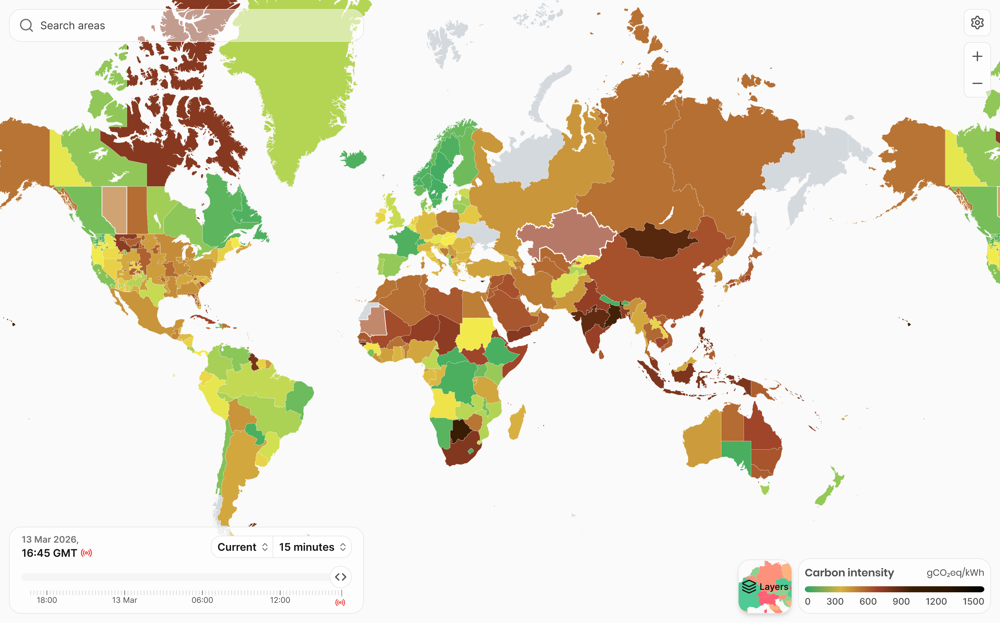
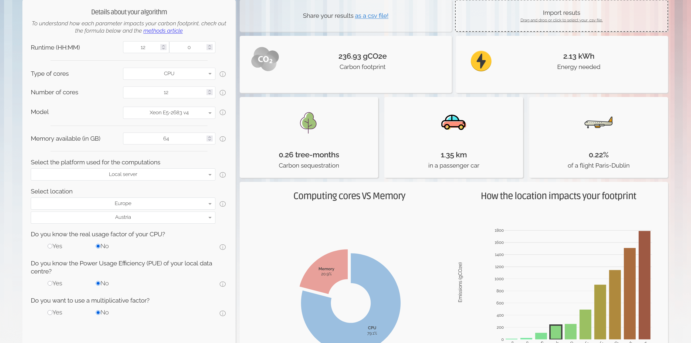

:::::::::::::::::::::::::::::::::::::: questions

- What questions should I ask before adopting an AI tool in my research workflow?
- What ethical responsibilities do I have as a researcher using AI?
- How do I handle transparency and reproducibility when AI has been part of my methodology?

::::::::::::::::::::::::::::::::::::::::::::::::::

::::::::::::::::::::::::::::::::::::: objectives

- Apply a set of critical evaluation questions to any AI tool before adopting it.
- Describe the key ethical concerns raised by the use of AI in research, including bias, transparency, privacy, and attribution.
- Explain why reproducibility is a particular challenge when AI is part of a research workflow.

::::::::::::::::::::::::::::::::::::::::::::::::

# Considerations When Working with AI

## Bias and Fairness

AI models do not arrive in the world as neutral tools. They are trained on data generated by human societies, and those societies contain historical and structural inequalities. A model trained on historical medical records will reflect historical disparities in who received care and who was documented. A model trained on published academic literature will reflect who has historically had access to publish.

The consequences can be serious. Models used for clinical risk prediction have been shown to perform worse on patients from groups underrepresented in the training data. Automated tools used in hiring or admissions have reproduced patterns of discrimination from historical decisions.

:::::::::::::::::::::::::::::::::::::::::::::::::::::::::::::::::: callout

### Amazon's AI Recruiting Tool

One of the most widely cited examples of AI bias comes from Amazon. Beginning in 2014, Amazon built an experimental AI tool designed to screen job applicants' resumes and rate candidates from one to five stars, with the goal of automating part of its hiring process for technical roles.

The system was trained on roughly a decade of resumes the company had previously received. Because the tech industry is male-dominated, the majority of those resumes came from men, and the system learned to favour male candidates over female ones. In practice, this meant the tool downgraded resumes that included the word "women's" — such as "women's chess club" — and penalised graduates of certain all-women's colleges. 

::::::::::::::::::::::::::::::::::::::::::::::::::::::::::::::::::::::::::

:::::::::::::::::::::::::::::::::::::::::::::::::::::::::::::::::: callout

### Racial Bias in Health Algorithms

Researchers found evidence of racial bias in one of the most widely used algorithms in the US health care system.

For patients assigned the same level of risk by the algorithm, Black patients were sicker than White patients. The authors estimated that this racial bias reduces the number of Black patients identified for extra care by more than half. This bias occurs because the algorithm uses health costs as a proxy for health needs. Less money is spent on Black patients who have the same level of need, and the algorithm thus falsely concludes that Black patients are healthier than equally sick White patients. Reformulating the algorithm so that it no longer uses costs as a proxy for needs eliminates the racial bias in predicting who needs extra care ([Obermeyer et al., 2019](https://www.science.org/doi/10.1126/science.aax2342)).

::::::::::::::::::::::::::::::::::::::::::::::::::::::::::::::::::::::::::

## Privacy and Data Governance

Many AI tools, particularly cloud-based LLMs, process data on external servers. If you input sensitive data such as patient records, interview transcripts, or confidential documents, into a commercial AI tool, you may be:

- Breaching participant confidentiality.
- Violating data protection legislation such as the UK GDPR.
- Contravening your institution's data governance policies or your ethical approval conditions.

Before inputting any data into an AI tool, check your institution's and research group's guidance on what categories of data may be processed in this way, and review the tool provider's privacy and data retention policies.

## Attribution and Authorship

LLMs have raised genuinely novel questions about authorship and attribution that the research community is still working through. Key issues include:

- **Authorship of AI-generated text:** most major publishers and funders now have explicit policies stating that AI tools cannot be listed as authors, because authorship carries accountability that an AI model cannot hold. However, policies on *disclosing* the use of AI in drafting or editing text vary and are evolving rapidly.
- **Attribution of AI-generated analysis:** if an LLM assists with qualitative coding or data interpretation, how should that contribution be disclosed in the methods section?
- **Copyright in training data:** LLMs are trained on text that may include copyrighted material. The legal and ethical status of this is an active area of debate.  By including AI-generated text or code in your research, you may inadvertantly be infringing copyright.

You should check the current policies of your target journal or funder, and your institution's own guidance, before submitting work in which AI has played a role.

::::::::::::::::::::::::::::::::::::: callout

## Publisher's Stance on AI Use in Academic Research

Summarised from - Rana, N. K. (2025). Generative AI and academic research: A review of the policies from selected HEIs.

- **Cambridge University Press:** AI tools cannot be credited as authors, and authors remain fully responsible for the accuracy, integrity, and originality of their work.

- **Nature Portfolio:** AI tools are not permitted as authors, their use must be transparently disclosed, and AI-generated images are generally prohibited due to unresolved legal and ethical concerns. Nature requires disclosure of LLM use in the Methods section (or an equivalent section), rather than in acknowledgements or citations.

- **Elsevier:** Elsevier allows AI-assisted tools for writing support, limited to improving clarity and readability. However, core scholarly activities, such as generating scientific insights, drawing conclusions, or making recommendations, must remain human-led. Elsevier requires authors to declare any AI tool usage and does not allow AI tools to be listed as authors. 

::::::::::::::::::::::::::::::::::::::::::::::::

### Citation

The outputs of AI aren't stable, they're likely to vary depending on prompt wording and the AI model version among other factors.  Therefore, they can't be reliably cited in the same way as you would cite a research paper or software package. 

Several universities and libraries recommend citing the tool used including the version and date, and describing how it was used.  Many AI tools now allow chats to be shared through URLs, meaning that specific chats can be cited if that would be appropriate and helpful to readers of the research.

[Duke University Libraries](https://guides.library.duke.edu/citing/AI?utm_source=chatgpt.com) gives the following guidance on how to cite an AI Chat and AI Tool in several different referencing styles.  For example, the APA style would be:

**AI Chat**
 
AI Company Name. (Year, Month Day). Title of chat [Description, such as Generative AI chat]. Tool Name/Model. URL of the chat.

Example: OpenAI. (2025, August 21). *High school grammar concepts* [Generative AI chat]. ChatGPT. https://chatgpt.com/share/68a77b60-0ee4-800c-9acc-cd3fd573c311

**AI Tool**
 
AI Company Name. (Year). Tool Name/Model [Description: e.g., Large language model]. URL of the tool

Example: OpenAI. (2025). *ChatGPT* [Large language model]. https://chatgpt.com/

::::::::::::::::::::::::::::::::::::::::: challenge

### Critically Reviewing AI Use in Qualitative Research

**Scenario**: You are reviewing a manuscript submitted to your field's leading journal. In the methods section, the authors write:

> *"Qualitative thematic analysis of interview transcripts was supported by an AI language model, which was used to generate initial codes. These codes were then reviewed and refined by the research team. The AI tool assisted with the analysis of all 47 transcripts."*

Discuss the following questions:

1. What information is missing from this methods description that you would need as a reviewer?
2. What risks or limitations should the authors have acknowledged?
3. What would a more complete and transparent methods statement look like?

::::::::::::::::::::: solution

### Points to consider

**Information that is missing:**

- Which AI tool was used, and which version? (Without this, the approach cannot be evaluated or replicated.)
- What prompts or instructions were given to the model?
- How were AI-generated codes accepted, modified, or rejected?
- Was the tool validated on similar data or in similar research contexts?
- How was participant data handled? Was it anonymised before being input? Was the tool's data retention policy checked against ethical approval conditions?

**Risks and limitations the authors should have acknowledged:**

- LLMs can produce plausible-sounding codes that do not accurately reflect the content of the transcript.
- The model may perform inconsistently across different transcripts, introducing variability that is difficult to detect.
- The model's outputs may reflect biases in its training data rather than patterns in the research data.
- If the same analysis were run again, the model might produce different initial codes.

**A more complete methods statement might include:**

- The name and version of the AI tool used.
- A description of how the tool was prompted and integrated into the coding workflow.
- A statement of how participant data was handled in compliance with ethical approval and data protection requirements.
- A description of the human review process e.g. how many researchers reviewed codes, whether inter-rater reliability was assessed, how disagreements were resolved.
- An explicit acknowledgement of the limitations of AI-assisted coding and how these were mitigated.

:::::::::::::::::::::::::::::

::::::::::::::::::::::::::::::::::::::::::::::::::

## Cognitive Offloading and De-skilling with Generative AI

AI tools are incredibly useful for research but there's a risk that's easy to overlook: the less we do something ourselves, the less capable we become at doing it.
This phenomenon has been called cognitive offloading and it isn't a new issue. For example:

- Calculators → we practice mental arithmetic less
- GPS → we build less internal sense of geography

Sometimes that trade-off is fine. However, research depends on thinking carefully, critically, and independently, so it's important to consider whether the trade-off is worth it here. 

**Example: AI-generated code**

If you use code to process data or run analyses, that code is part of your methodology. 

- If you didn't write it and don't fully understand it, you can't be 100% confident in your results.
- AI-generated code can contain subtle errors that produce plausible-looking but wrong results
- A researcher who understands the code can catch these errors but one who doesn't, might not
- Those errors can directly affect your results

More generally, every time we outsource a cognitive task to an AI, we don't get the practice at doing it ourselves. Over time, this can make us lose the underlying skill. 

- A researcher who always asks an LLM to summarise papers may gradually lose the habit of reading them carefully. 
- A researcher who always asks an LLM to draft text may find their own writing voice harder to find. 

Research depends on deep and independent thinking.  To do good research, researchers need to sit with a difficult problem, reason through it and arrive at your own conclusions.  Using AI thoughtfully involves deliberate decisions about which tasks to outsource to AI and which to do yourself, not because an AI couldn't do it, but because it's a part of your human intelligence that you'd like to protect. 

:::::::::::::::::::::::::::::::::::::::::::::::::::::::::::::::::: callout

### AI Impact on Critical Thinking

A large mixed-methods study investigated the impact of AI usage on critical thinking skills using surveys and in-depth interviews.

It was found that AI tool use was significantly negatively associated with critical thinking abilities and that this association was mediated (explained) by increased cognitive offloading. 

The author argues that 'these results highlight the potential cognitive costs of AI tool reliance, emphasising the need for educational strategies that promote critical engagement with AI technologies.'

[Gerlich, M. (2025). AI tools in society: Impacts on cognitive offloading and the future of critical thinking. Societies, 15(1), 6.](https://www.mdpi.com/2075-4698/15/1/6?ref=blog.continue.dev)

::::::::::::::::::::::::::::::::::::::::::::::::::::::::::::::::::::::::::

## Environmental Cost of AI

The environmental cost of AI is larger and more complex than most users appreciate. 

AI tools run on data centres.  These are large warehouses full of powerful computers that store data and run the calculations behind everyday digital services, including AI systems like chatbots. Data centres need large amounts of electricity to power the computers and, because these computers generate a lot of heat when running, they also require large amounts of water to keep them cool.

Due to increasing demand, data centres could consume up to 9% of global electricity demand by 2030 ([Hankendi et al., 2025](https://pmc.ncbi.nlm.nih.gov/articles/PMC12613045/)). AI systems are the fastest-growing source of this demand, but measuring their precise impact is difficult because operators rarely separate AI computing tasks (often called 'workloads') from non-AI computing tasks (workloads) in their environmental reporting. 

The most recent estimates suggest that in 2025, AI systems generated carbon emissons comparable to the annual emissions of a major city (up to 79.7 million tonnes of carbon) and consumed an amount of water comparable to global bottled water consumption (up to 764 billion litres of water) ([de Vries-Gao, 2025](https://doi.org/10.1016/j.patter.2025.101430)). 

{alt="Google Data Center, The Dalles, Oregon"}

Environmental costs accumulate across the full lifecycle of an AI model. This includes the water and carbon used to manufacture the specialist chips required to run the AI; the intensive one-off cost of training the model; and the ongoing costs of inference (the cost every time a query is run).

**Lifetime costs**: Embodied carbon (the carbon produced from manufacturing the hardware) can account for a significant fraction of the overall environmental cost of the model, but it is challenging to calculate and seldom reported. 

**Training**: A [2019 study](https://www.technologyreview.com/2019/06/06/239031/training-a-single-ai-model-can-emit-as-much-carbon-as-five-cars-in-their-lifetimes/#:~:text=A%20paper%20from%20the%20University%20of%20Massachusetts%2C,on%20teaching%20machines%20to%20handle%20human%20language.) found that training a single large transformer model can emit over 283,000 kg (626,000 pounds) of carbon, which is roughly equivalent to five times the lifetime emissions of an average American car (including the emissions from building the car!). 

**Inference**: Although many people believe that initial training has the largest environmental cost, recent studies have found that inference can actually account for up to 90% of a model’s lifetime energy use ([Desislavov et al., 2023](https://www.sciencedirect.com/science/article/pii/S2210537923000124)). Water consumption follows a similar pattern, with estimates suggesting a standard ChatGPT conversation of 20–50 exchanges requires roughly 500 millilitres of freshwater for cooling the servers in data centres ([Li et al., 2023](https://dl.acm.org/doi/10.1145/3724499)).

Not all AI is equally environmentally expensive. General-purpose LLMs are orders of magnitude more energy-intensive per inference than smaller, task-specific models performing the same job. This means that the convenience of using a single general-purpose LLM interface can carry a substantial and largely invisible environmental cost when multiplied across many uses. A fine-tuned model used for classification or information extraction may produce comparable results at a fraction of the per-query energy cost ([Luccioni et al., 2024](https://doi.org/10.1145/3630106.3658542)).

Where the data centre is located also affects the environmental impact. A data centre draws electricity from its local grid and therefore its environmental footprint depends heavily on how the region in which it's located generates power. A data centre on a grid powered mostly by renewables (wind, solar, hydropower) will have a far smaller footprint than an identical one on a grid powered mostly by fossil fuels, even when running exactly the same workload.

The [Electricity Maps](https://app.electricitymaps.com/map/live/fifteen_minutes) website maps the amount of greenhouse gas emitted for every unit of electricity produced for data centres across the world. Looking at the map, it’s clear that training an AI model in a data center in Scandinavia would have a lower environmental impact than training the model in Australia. Scandinavian grids rely heavily on hydropower and wind (low carbon intensity), while Australia's still relies more on coal (much higher). 

{alt="Screenshot of the electricity maps website showing the carbon intensity i.e. the grams of CO2 equivalent per kilowatt-hour (gCO2eq/kWh) measuring the greenhouse gas emissions from generating electricity"}

:::::::::::::::::::::::::::::::::::::::::::::::::::::::::::::::::: callout

### Renewable Energy Certificates 

However, the relationship between renewable energy and AI's actual carbon footprint is more complex than it first appears. 

Many data centre operators claim to run on renewable energy by purchasing Renewable Energy Certificates (RECs), which allow them to offset their consumption on paper without necessarily drawing clean power from the grid in real time. 

This distinction - between matching renewable energy and actually using it - has attracted significant criticism of major providers including Google and Microsoft ([Bjørn et al., 2022](https://www.nature.com/articles/s41558-022-01379-5)).

::::::::::::::::::::::::::::::::::::::::::::::::::::::::::::::::::::::::::

Some tools exist that can help developers better understand the cost of training and inference, for example in the Green Algorithms AI calculator users can enter details on the hardware, runtime, and location of the work and see the potential environmental cost: [https://calculator.green-algorithms.org/ai](https://calculator.green-algorithms.org/ai).

{alt="Screenshot of the green algorithms calculator"}

Overall, the biggest obstacle to accurate environmental accounting for AI is the problem of transparency. The companies operating the largest AI systems publish very little useful data. Furthermore, the published per-query emissions figures from AI providers typically reflect optimised, market-based conditions rather than an accurate estimate of carbon and water usage ([de Vries-Gao, 2025](https://doi.org/10.1016/j.patter.2025.101430)). 

Until providers are required to report location-based emissions data transparently and consistently, the true environmental cost of AI will remain difficult to measure and easy to understate ([Masanet et al., 2024](https://www.cell.com/joule/fulltext/S2542-4351(24)00347-7)).

::::::::::::::::::::::::::::::::::::::::: challenge

## Do the benefits of AI justify its environmental costs?

Do the benefits of AI justify its environmental costs? Where should we draw the line?

::::::::::::::::::::: solution

## Points to consider

### Benefits Justify Costs

- AI is already being used in climate-relevant applications: optimising energy grids, accelerating materials discovery for batteries and solar cells, improving weather and climate modelling, and monitoring deforestation via satellite imagery. These applications could meaningfully contribute to decarbonisation long-term.
- Drug discovery and medical diagnostics applications could save lives and reduce the resource burden of healthcare systems.
- Efficiency gains from AI in logistics, agriculture, and manufacturing may reduce emissions elsewhere in the economy, potentially offsetting AI's own footprint.

### Costs Outweigh Benefits

- The benefits of AI are often speculative or early-stage, while the environmental costs are immediate and certain. Should we be justifying present costs with uncertain future benefits?
- Many of the highest-energy AI applications, such as generating images, powering chatbots, and recommending content, have unclear societal benefit relative to their cost.
- Efficiency gains from new technologies have historically tended to increase overall consumption.  This a phenomenon known as the [Jevons paradox](https://en.wikipedia.org/wiki/Jevons_paradox) because in 1865, the English economist William Stanley Jevons observed that technological improvements that increased the efficiency of coal use led to the increased consumption of coal in a wide range of industries. 
- The benefits of AI are unevenly distributed globally, while environmental costs, particularly water stress, fall disproportionately on communities that may derive little benefit from the technology.

### Who decides where we draw the line?

- "Societal benefit" is not a neutral concept, it depends on whose society and whose benefits are being counted. Researchers, developers, regulators, and affected communities may weigh the trade-offs very differently.
- Individual researchers have limited power over the training of frontier models, but they do have agency over which tools they choose, how often they use them, and whether they advocate for greater transparency and accountability from providers.
- Should the decision be left to market forces, regulated by governments, or governed by professional communities such as researchers?

### Where do we draw the line?

- Is it possible to draw a principled line, or does it require case-by-case judgement? A diagnostic AI that saves lives in a resource-limited setting may be easier to justify than a generative AI that writes marketing copy.
- Should the burden of proof lie with those deploying AI to demonstrate net benefit, or with critics to demonstrate net harm?
- Who bears responsibility? Is it the companies training the models, the institutions deploying them, or the researchers using them?

:::::::::::::::::::::::::::::

::::::::::::::::::::::::::::::::::::::::::::::::::

## Looking Ahead: Developing Your AI Literacy

This course has given you a map of the AI landscape and the vocabulary to navigate it. 

A few practical suggestions for developing your AI literacy beyond this course:

- **Follow your institution's guidance.** Most universities and research funders are actively developing AI use policies. These are the most directly relevant to your work, and they will continue to evolve. For example, for researchers at the University of Southampton, point 3.8 of the [Ethics Policy for Research at University of Southampton](https://www.southampton.ac.uk/about/governance/regulations-policies/policies/ethics) shows the Principle of ethical conduct of research when using Artificial Intelligence (AI) and students should also consult guidance on [Using generative artificial intelligence during your studies ](https://www.southampton.ac.uk/about/governance/regulations-policies/policies/using-gen-ai-during-your-studies).
- **Engage with your research community.** Methodological norms for AI use in research are being worked out discipline by discipline. Engaging with debates in your own field's journals and conferences is more valuable than generic AI news.
- **Start small and validate.** If you are considering integrating an AI tool into your workflow, start with a small, low-stakes task and validate the outputs carefully before scaling up.
- **Be transparent.** When in doubt about how much to disclose about your use of AI, err on the side of transparency. The research community is better served by over-disclosure than by the opposite.

::::::::::::::::::::::::::::::::::::: keypoints

- Before adopting any AI tool, ask: what was it trained on? Has it been validated? Can results be reproduced? Can outputs be explained? What are the failure modes?
- AI models reflect the biases in their training data.
- Transparency in methods is essential: report which tools were used, at what version, for what purpose, and how outputs were validated.
- Privacy and data governance must be considered before inputting any sensitive or personal data into an AI tool.
- Authorship, attribution, and environmental cost are emerging ethical considerations that researchers should engage with actively.
- Consider the impacts on human intelligence when outsourcing tasks to AI
- Developing AI literacy is an ongoing practice: follow institutional guidance, read model documentation, and engage with methodological debates in your own field.

::::::::::::::::::::::::::::::::::::::::::::::::

## References

- [Edwards, S. V., Reeve, A. H., & Jonsson, J. E. (2023). Machine learning classification of birdsong syllables from multiple species. Scientific Reports, 13, 7824.](https://doi.org/10.1038/s41598-023-33825-5)
- [Debus, M., Appel, M., Häfner, S., Sabourin, G., & Mermoz, S. (2025). Identification of deforestation drivers in Cameroon using deep learning with Landsat-8 satellite imagery. Remote Sensing of Environment, 317, 114546.](https://doi.org/10.1016/j.rse.2024.114546)
- [Afriyie, J. K., Tawiah, K., Pels, W. A., Addai-Henne, S., Dwamena, H. A., Owiredu, E. O., Ayeh, S. A., & Eshun, J. (2023). A supervised machine learning algorithm for detecting and predicting fraud in credit card transactions. Decision Analytics Journal, 6, 100163.](https://doi.org/10.1016/j.dajour.2023.100163)
- [Gerlich, M. (2025). AI tools in society: Impacts on cognitive offloading and the future of critical thinking. Societies, 15(1), 6.](https://www.mdpi.com/2075-4698/15/1/6?ref=blog.continue.dev)
- [de Vries-Gao, A. (2025). The carbon and water footprints of data centers and what this could mean for artificial intelligence. Patterns, 6, 101430.](https://doi.org/10.1016/j.patter.2025.101430)
- [Li, P., Yang, J., Islam, M. A., & Ren, S. (2023). Making AI less "thirsty": Uncovering and addressing the secret water footprint of AI models. Communications of the ACM.](https://dl.acm.org/doi/10.1145/3724499)
- [Luccioni, A. S., Jernite, Y., & Strubell, E. (2024). Power hungry processing: Watts driving the cost of AI deployment. Proceedings of the 2024 ACM Conference on Fairness, Accountability, and Transparency, 85–99](https://doi.org/10.1145/3630106.3658542)
- [Lannelongue, L., Grealey, J., Inouye, M., Green Algorithms: Quantifying the Carbon Footprint of Computation. Adv. Sci. 2021, 2100707. https://doi.org/10.1002/advs.202100707](https://calculator.green-algorithms.org/)
- [Electricity Maps](https://app.electricitymaps.com/map/live/fifteen_minutes)
- [Obermeyer, Z., Powers, B., Vogeli, C., & Mullainathan, S. (2019). Dissecting racial bias in an algorithm used to manage the health of populations. Science, 366(6464), 447-453.](https://www.science.org/doi/10.1126/science.aax2342)
